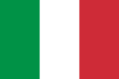

Per inserire una nuova bandiera, andare a questo link 
https://en.wikipedia.org/wiki/Gallery_of_sovereign_state_flags, 
scegliere l'immagine della bandiera desiderata in formato .svg.png, 
caricarla in questa cartella rinominandola: 
<code>Lang-[<a href="https://en.wikipedia.org/wiki/List_of_ISO_639-2_codes">Codice ISO della lingua</a>].svg.png</code>.

To add a new flag, go to this link 
https://en.wikipedia.org/wiki/Gallery_of_sovereign_state_flags, 
choose and save the pic of your flag in format .svg.png, 
upload in this folder and rename it: 
<code>Lang-[<a href="https://en.wikipedia.org/wiki/List_of_ISO_639-2_codes">Language ISO code</a>].svg.png</code>.

