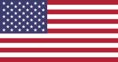

<h1>Folder Info</h1>

This folder contains only files used in readmes, it doesn't belong to application

To use American flag use this code <code>&ltimg src="https://raw.githubusercontent.com/ken-korn/Key-Pocket/master/zReadme_files/Lang-Eng.svg.png" height=50px width=100px&gt</code>

 

<h1>Info Cartella</h1>

Questa cartella contiene solo file usati nei readme, non fa parte dell'applicazione

Per inserire la bandiera italiana usare questo codice <code>&ltimg src="https://raw.githubusercontent.com/ken-korn/Key-Pocket/master/zReadme_files/Lang-Ita.svg.png" height=50px width=100px&gt
</code>

